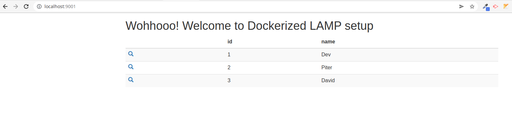

# LAMP

This project explains the setup instruction of LAMP with and without docker.

## Local LAMP setup in Ubuntu

To install (Apache, PHP, MariaDB, PHPMyAdmin), please open your terminal and follow the below simple steps:

1. Install apache2 package:

```
sudo apt install apache2
```

2. Enable apache service

```
sudo systemctl stop apache2.service
sudo systemctl start apache2.service
sudo systemctl enable apache2.service
```

3. Install mariadb server and client:

```
sudo apt-get install mariadb-server mariadb-client
```

4. Enable mariadb server:

```
sudo systemctl stop mariadb.service
sudo systemctl start mariadb.service
sudo systemctl enable mariadb.service
```

4. Setup mariadb server:

```
sudo mysql_secure_installation
```
Enter current password for root (enter for none): Just press the Enter

Set root password? [Y/n]: Y

New password: Enter a new password

Re-enter new password: Repeat your password

Remove anonymous users? [Y/n]: Y

Disallow root login remotely? [Y/n]: Y

Remove test database and access to it? [Y/n]: Y

Reload privilege tables now? [Y/n]: Y

5. Install php7.4
(for any other version change the 7.4 to respective version, for intance php8.0 , Same logic is applicable for the php extension installation also.)

```
sudo apt-get install software-properties-common
sudo add-apt-repository ppa:ondrej/php
sudo apt install php7.4-fpm php7.4-common php7.4-mbstring php7.4-xmlrpc php7.4-soap php7.4-gd php7.4-xml php7.4-intl php7.4-mysql php7.4-cli php7.4-zip php7.4-curl libapache2-mod-php7.4
```
6. To ensure the php installation, check your php version

```
php -v
```

7. Install phpmyadmin

```
sudo apt install phpmyadmin
```

Select the apache2 server
Configure database for phpmyadmin with dbconfig-common? Yes

Now configure your phpmyadmin with mariadb

sudo mysql -u root (if prompting for the password, use your new password)
Flush the local user access
use mysql;
update user set plugin='' where User='root';
flush privileges;
exit

8. Restart mariadb server to make all the changes effective

```
sudo systemctl restart mariadb.service
```

Open your localhost (now you should see the apache2 default page)

To access phpmyadmin, open localhost/phpmyadmin

Hope this helps!!

[phpMyAdmin](https://websiteforstudents.com/how-to-install-phpmyadmin-on-ubuntu-linux-with-apache/)
[Composer](https://www.digitalocean.com/community/tutorials/how-to-install-and-use-composer-on-ubuntu-20-04)

## LAMP using docker

**Apache**

**MySql 8.0**

**PhpMyAdmin**

**PHP 8 (Default)**

NOTE: for **php7.4** copy the below code replace with the existing [Dockerfile content](Dockerfile)

```
FROM php:7.4-apache 
RUN docker-php-ext-install mysqli pdo_mysql
RUN apt-get update \
    && apt-get install -y libzip-dev \
    && apt-get install -y zlib1g-dev \
    && rm -rf /var/lib/apt/lists/* \
    && docker-php-ext-install zip
```

For further PHP related docker modification see the [reference](https://github.com/Actency/docker-apache-php) .

### Docker setup

Prerequisite :

1. check for docker installation.

```
docker -v
```

Otherwise install [docker](https://www.digitalocean.com/community/tutorials/how-to-install-and-use-docker-on-ubuntu-18-04)

2. SSH key added in [NetTantra code station](https://code.nettantra.com/)
Otherwise do the [SSH Key Setup](https://code.nettantra.com/setupguide/ssh-key)

3. VSCODE [Docker extention](https://marketplace.visualstudio.com/items?itemName=ms-azuretools.vscode-docker)

---

1. Clone the repository

```
git clone git@code.nettantra.com:setupguide/lamp.git
```

2. Go to repository

```
cd lamp
```

3. Build dockerfile

```
docker-compose build
```

Wait for few minutes (It takes time!!)

4. Up the docker containers

```
docker-compose up -d
```

if you want to see the docker log then use below command

```
docker-compose up
```

5. Go to your browser and visit:

   _See [docker-compose.yml](docker-compose.yml) file for reference_

Simple php example: http://localhost:9001/

phpmyadmin: http://localhost:9002/

(username: root , password: root)


# docker-mariadb
